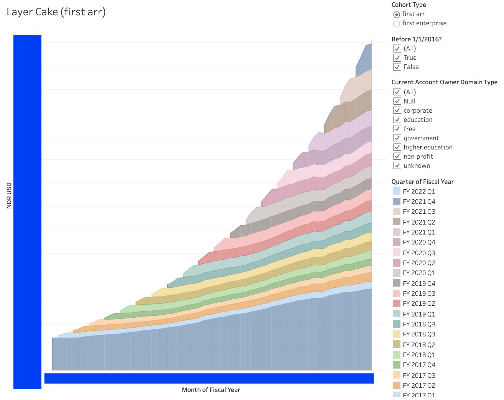
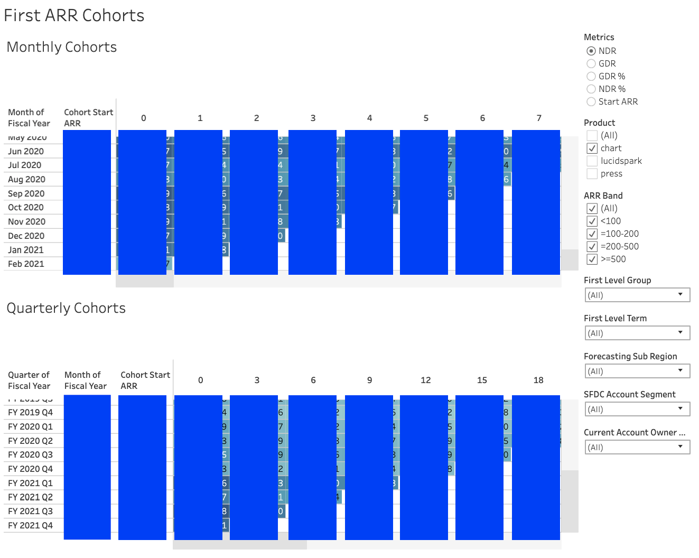
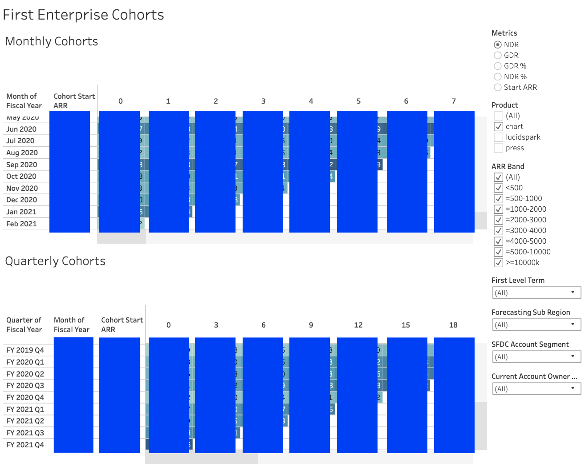
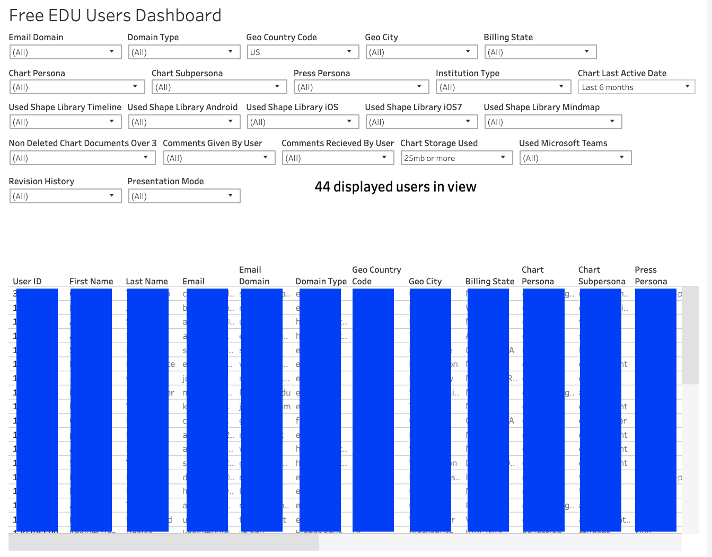

# lucid-analytics
Each of these folders represents a different project that I owned while working at Lucid Software. Smaller data pulls or simple requests weren't included, as well as projects that rely on proprietary information. All code was written by me unless otherwise stated!
 

## arr categorization by cohort
The purpose of this project was to better understand how monthly ARR cohorts behave. To that end, I created an ARR cohorting rollup model and Tableau dashboard with multiple views, shown below. Along with the code for the model, I included the code for two macros I created to build ARR banding.
 

|  |  |   |
|:---:|:---:|:---:|
| Layer cake view | First ARR cohorting| First enterprise cohorting|

  

## data pull
The purpose of this project was to assist a stakeholder who needed the same education data pulled frequently enough to justify automating it. The data model in this project folder was built to power a Tableau dashboard (that I also created) so that the stakeholder could self-serve. Tableau dashboard shown below.
 

| 
 
 |
|:---:|
| EDU dashboard|
  

## forecast modeling
The purpose of this project was to update existing data models to include fiscal year 2022 forecasting data. In order to update existing models, I created new forecasting tables in Snowflake (all are listed in the external_sources.yml file) and created new calendarization files for use in models downstream (not included due to proprietary concerns).
 

## international monthly reporting
The purpose of this project was to create a new Tableau dashboard that brought together several existing, company-wide metrics at the same international-monthly grain. ARR international monthly reporting (arr imr) demonstrates a 'wide' rollup model, funnel international monthly reporting (funnel imr) demonstrates a 'long' rollup model. The stakeholder for this project wanted 2 views with slightly different grains, thus the different model structures. Finished Tableau dashboard not included due to proprietary concerns.
 